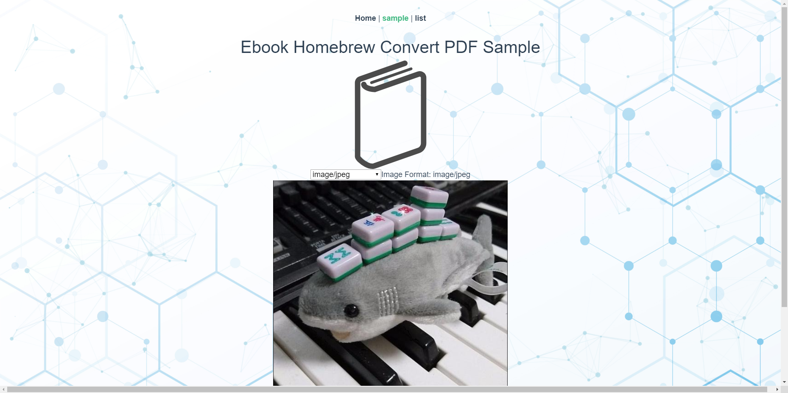
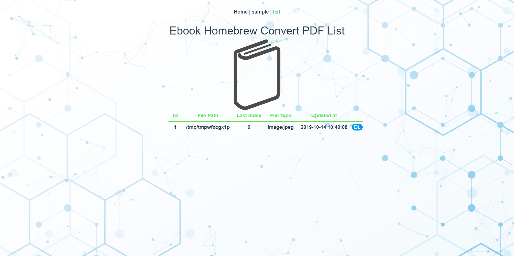

The Ebook HomeBrew provides you functional [APIs] which make e-book format files from images.
It is made by Python, Vue.js, Docker and taking in latest technologies.(Recently, GitHub Action, GitPitch, automatic testing with CI, automatic deployment, etc.)

It also provides functional Python modules which file name to only digit name like 001.jpg and make e-book format files, [reference here].

The demo site made by heroku, [demo here]

<!--- reference links --->
[APIs]: <https://ebook-homebrew.herokuapp.com/docs>
[reference here]: <https://ebook-homebrew.readthedocs.io/en/latest/index.html>
[demo here]: <https://ebook-homebrew.herokuapp.com/#/>
