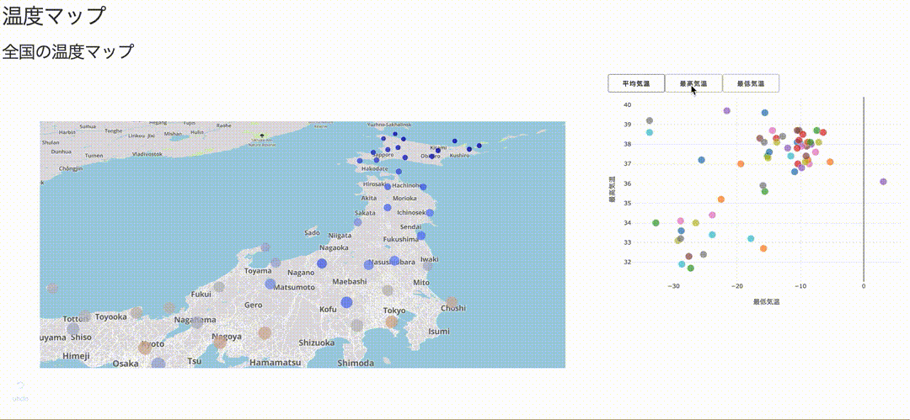

Data science with AWS tutorial course using Weather Data for Recruit Restaurant Competition.

This tutorial course is handson you understanding ETL(Extract, Transform, Load) and creating those structure using AWS managed services.

More information, read the [GitHub here]

### Boot Camp for Data science with AWS

If you are interested in Data science with AWS but being unskilled, Read the Text below

[AWSで作る分析基盤 (Japanese)
](https://www.slideshare.net/tubone24/aws-158992259)

### AWS

This tutorial will be used many managed services such as...

- S3
- Athena
- Glue
- Elastic Beanstalk
- Lambda
- Elasticsearch service(not implemented)

#### Architecture

1. Collect weather datas on weather stations in all locations in Japan. In the tutorial, you can download from kaggle using kaggle API.
2. Put datas in origin buckets. Weather datas are put `weather-datas` , station location datas are `station-datas` prefix.
3. Crawl `weather-datas` and ETL job because of adding `station_id` .
4. Execute Athena queries because of creating several CSVs such as `station` and `weather_with_station_id` .
5. Put query results in the result bucket. Create Elastic Beanstalk and run `Dash` .
6. Or put Elasticsearch using the Lambda function.
7. Enjoy a `Dash` plots or Elasticsearch `Kibana` .

## Datasource
Weather Data for Recruit Restaurant Competition
(https://www.kaggle.com/huntermcgushion/rrv-weather-data/discussion/46318)

Using two datas

- Weather
  - weather data
- weather_stations.csv
  - station data (include longitude latitude)
  

<!--- reference links --->
[GitHub here]: <https://github.com/tubone24/rr-weather-data-with-aws>
[demo here]: <https://rr-weather-data-with-aws-demo.herokuapp.com/>
